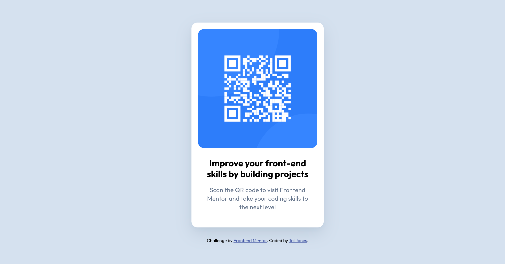

# Frontend Mentor - QR code component solution

This is a solution to the [QR code component challenge on Frontend Mentor](https://www.frontendmentor.io/challenges/qr-code-component-iux_sIO_H). Frontend Mentor challenges help you improve your coding skills by building realistic projects.

## Table of contents

- [Overview](#overview)
  - [Screenshot](#screenshot)
  - [Links](#links)
- [My process](#my-process)
  - [Built with](#built-with)
  - [What I learned](#what-i-learned)
  - [Useful resources](#useful-resources)
- [Author](#author)

## Overview

This is my QR-code card made with a figma design file and HTML/CSS.

### Screenshot



### Links

- Solution URL: [QR-Code-Repository](https://github.com/ProgramJones/qr-code-component)
- Live Site URL: [QR-Code-Live-View](https://programjones.github.io/qr-code-component/)

## My process

1. Created the boilerplate HTML.
2. Created the generic css styles from the style guide and figma file.
3. Created the specific styles for each element.

### Built with

- Semantic HTML5 markup
- CSS custom properties
- Flexbox
- Mobile-first workflow

### What I learned

The big takeaway from this project was adding layers of box-shadow for a cleaner result.

```
box-shadow: 0 5px 10px rgba(104, 119, 141, 0.05),
    0 15px 40px rgba(104, 119, 141, 0.2);
```

### Useful resources

- [Box Shadow Layering](https://www.reddit.com/r/web_design/comments/bwtk83/simple_trick_to_make_your_boxshadows_look_much/) - This is the first time I've heard of layering box shadows. It makes much softer shadows.

## Author

- Frontend Mentor - [@ProgramJones](https://www.frontendmentor.io/profile/ProgramJones)
